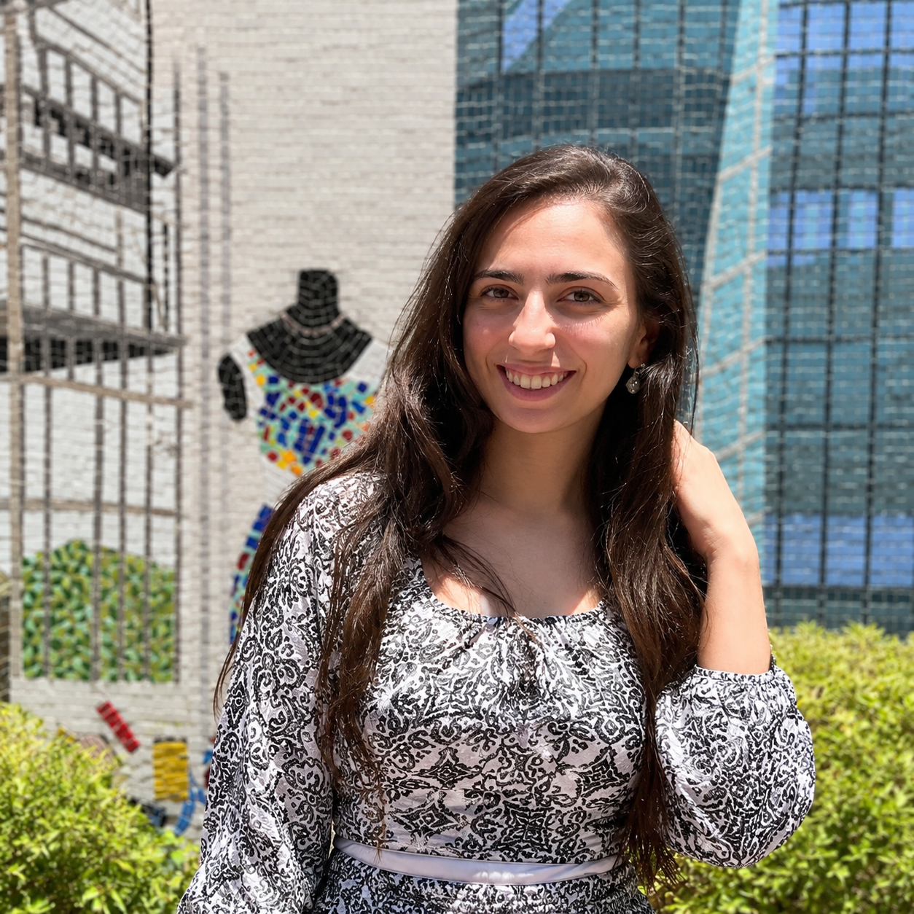

<!DOCTYPE html>
<html lang="en">
<head>
<meta charset="UTF-8">
<meta name="viewport" content="width=device-width, initial-scale=1.0">

<title>Nada Hussin | Textile Engineering</title>

</head>

<body>

<!-- NAVIGATION -->

<nav>

    

        NH.
    

    

        <a href="#about">About</a>
        <a href="#skills">Skills</a>
        <a href="#portfolio">Portfolio</a>
        <a href="#contact">Contact</a>
    

</nav>

<!-- HERO -->

<section class="hero">

    

        

            

                Textile Engineering · Creative Design
            

            <h1>
                Nada 
                Hussin
            </h1>

            

                Textile Engineering graduate with a passion for
                textile printing, creative design and product
                development. Combining technical textile knowledge
                with modern visual design to create innovative
                and functional ideas.
            

        

        

            

        

    

</section>

<!-- ABOUT -->

<section id="about">

    

        About Me
    

    

        

            I am a fresh graduate specialized in Textile Engineering,
            with an academic background in textile printing, dyeing
            and finishing.
        

        

            I am interested in combining textile technology,
            creative design and product development to create
            innovative textile applications.
        

    

</section>

<!-- SKILLS -->

<section id="skills">

    

        Skills
    

    

        

            Textile Printing
        

        

            Dyeing & Finishing
        

        

            Textile Engineering
        

        

            Adobe Photoshop
        

        

            Adobe Illustrator
        

        

            Canva
        

        

            Product Design
        

        

            Creative Design
        

    

</section>

<!-- PORTFOLIO -->

<section id="portfolio" class="portfolio">

    

        

            Portfolio
        

        

            Explore my complete portfolio, including my academic work,
            textile projects, creative work and graduation project.
        

        <a
            class="button"
            href="https://drive.google.com/file/d/1zQh8uhki6JQjfAGkhOvf1gMZtmOE_b1t/view?usp=sharing"
            target="_blank"
        >
            VIEW FULL PORTFOLIO →
        </a>

    

</section>

<!-- CONTACT -->

<section id="contact" class="contact">

    

        Contact Me
    

    

        

            I am open to new opportunities, collaborations,
            internships and creative projects in the textile field.

        

        

            

                <strong>Email</strong> 

                <a href="mailto:nhussin442@gmail.com">
                    nhussin442@gmail.com
                </a>

            

            

                <strong>Phone</strong> 

                <a href="tel:01095578083">
                    01095578083
                </a>

            

            

                <strong>LinkedIn</strong> 

                <a
                    href="https://www.linkedin.com/in/nada-hussin-7693862a0"
                    target="_blank"
                >
                    linkedin.com/in/nada-hussin-7693862a0
                </a>

            

            

                <strong>Location</strong> 

                Gesr El Suez, El Haykstep, Cairo, Egypt

            

        

    

</section>

<!-- FOOTER -->

<footer>

    © 2026 Nada Hussin · Textile Engineering 

</footer>

</body>
</html>
